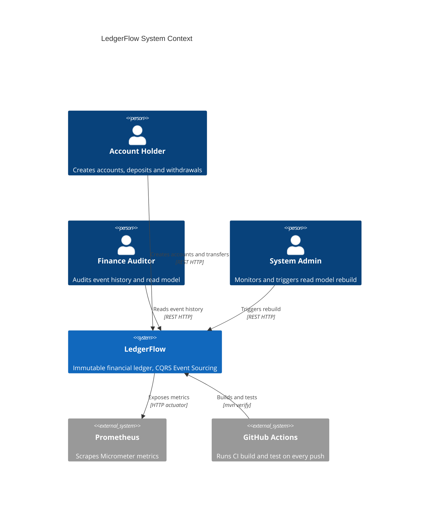

<h1 align="center">LedgerFlow</h1>

<p align="center">
  <strong>Immutable financial ledger for account managers and auditors — state rebuilt entirely from an append-only event log, never stored directly</strong>
</p>

<p align="center">
  
  
  
  
  
  
  
  
</p>

---

## About

LedgerFlow is a portfolio project demonstrating CQRS and Event Sourcing patterns in production-grade Java. Every financial operation is stored as an immutable domain event — accounts, deposits, withdrawals, and transfers are never persisted as row updates. Current account state is reconstituted by replaying the full event history on demand.

The domain is intentionally focused so the architecture takes center stage: the write side appends to an append-only event store protected by optimistic locking, while the read side consumes domain events via in-process Spring Events to maintain denormalized read models optimized for queries. No shared state between the command and query sides.

The architecture was designed to make every financial operation auditable by construction — there is no state that cannot be explained by a sequence of events.

---

## Architecture

### System Context (C4 Level 1)



### Key Design Decisions

| Decision | Rationale | ADR |
|----------|-----------|-----|
| Event Sourcing over CRUD | Financial auditability requires a complete, immutable history of every state change — CRUD updates destroy that history permanently | [ADR-001](./docs/adr/ADR-001-event-sourcing-vs-crud.md) |
| Single transaction for cross-aggregate transfer + publishEvent inside PostgresEventStore | Transfer atomicity requires both saves to commit together; publishing inside the store guarantees event ordering and publish-after-persist within the same transaction | [ADR-002](./docs/adr/ADR-002-cross-aggregate-transfer-and-publish-placement.md) |
| In-process Spring Events over Kafka | Zero infrastructure overhead for a single-node portfolio project; read model updated atomically with the event store — no staleness window | [ADR-003](./docs/adr/ADR-003-in-process-events-vs-kafka.md) |
| Snapshot deferred to post-MVP, threshold 500 events | MVP accounts stay well under 500 events; snapshot infrastructure adds complexity before the event schema stabilizes | [ADR-004](./docs/adr/ADR-004-snapshot-strategy-deferred.md) |

See full architecture documentation in [docs/architecture/](./docs/architecture/README.md).

---

## Tech Stack

| Layer | Technology | Why |
|-------|------------|-----|
| Language | Java 21 Temurin | Virtual Threads for I/O-bound request handling; Records for immutable events and DTOs with zero boilerplate |
| Framework | Spring Boot 3.3 LTS | Production-grade ecosystem; virtual threads enabled with a single config flag |
| Event Store | PostgreSQL 16 + JSONB | ACID compliance is non-negotiable for financial data; JSONB event payloads allow schema evolution without migrations per event type |
| Schema migrations | Flyway 10 | Version-controlled DDL; Flyway owns schema evolution so Hibernate validates only — no surprises in prod |
| Testing | JUnit 5 + Testcontainers + ArchUnit | Real PostgreSQL in integration tests (no H2 drift); ArchUnit enforces layer boundaries on every build |
| Observability | Micrometer + Prometheus | Business metrics (replay duration percentiles, command counters); structured JSON logs via Logback+Logstash in prod |
| Build & CI | Maven + GitHub Actions + OWASP | Dependency Check runs on every push with CVSS ≥ 7.0 fail threshold |

---

## Getting Started

### Prerequisites

- Docker and Docker Compose
- Java 21 (Temurin recommended)

### Run locally

```bash
git clone https://github.com/wesleytaumaturgo/ledger-flow.git
cd ledger-flow
cp .env.example .env       # fill in real values
docker compose up -d       # starts PostgreSQL 16 on port 5432
./mvnw spring-boot:run
```

Application: `http://localhost:8080`  
Health: `http://localhost:8080/actuator/health`  
Metrics: `http://localhost:8080/actuator/prometheus`

---

## Environment Variables

| Variable | Description | Example | Required |
|----------|-------------|---------|----------|
| `DATABASE_URL` | PostgreSQL JDBC connection string | `jdbc:postgresql://localhost:5432/ledgerflow` | Yes |
| `DATABASE_USER` | PostgreSQL username | `ledgerflow_app` | Yes |
| `DATABASE_PASSWORD` | PostgreSQL password | `—` (use `.env`) | Yes |
| `ADMIN_API_KEY` | Secret key for admin endpoints (`X-Admin-Key` header) | `—` (use `.env`) | Yes |
| `APP_NAME` | Application name injected into metrics tags and logs | `ledger-flow` | No (default: `ledger-flow`) |
| `SPRING_PROFILES_ACTIVE` | Active Spring profile | `local` | No (default: `local`) |

Copy `.env.example` to `.env` and fill in real values. `.env` is excluded from git via `.git/info/exclude`.

---

## Project Structure

```
src/main/java/com/wesleytaumaturgo/ledgerflow/
├── command/
│   ├── domain/
│   │   ├── model/          ← Account aggregate, Money value object, domain events
│   │   ├── repository/     ← EventStore interface (pure Java, no framework)
│   │   └── exception/      ← DomainException hierarchy (InsufficientFunds, AccountNotFound)
│   ├── application/
│   │   └── usecase/        ← CreateAccount, Deposit, Withdraw, Transfer (@Transactional)
│   └── infrastructure/
│       └── eventstore/     ← PostgresEventStore (JdbcTemplate + JSONB serialization)
├── query/
│   ├── domain/
│   │   └── model/          ← AccountSummary, TransactionHistory read models
│   ├── application/
│   │   ├── projectors/     ← AccountProjector (idempotent, last_event_sequence guard)
│   │   └── usecase/        ← GetBalance, GetTransactionHistory, GetEventHistory
│   └── infrastructure/
│       └── persistence/    ← Spring Data JPA repositories for read model tables
├── api/                    ← AccountCommandController, AccountQueryController, AdminController
└── shared/
    └── infrastructure/     ← CorrelationIdFilter, GlobalExceptionHandler, AdminAuthFilter
```

---

## API Reference

Full API documentation available at `http://localhost:8080/swagger-ui.html` after startup.

### Command Side

| Method | Endpoint | Description |
|--------|----------|-------------|
| `POST` | `/api/v1/accounts` | Create a new account |
| `POST` | `/api/v1/accounts/{id}/deposit` | Deposit money into account |
| `POST` | `/api/v1/accounts/{id}/withdraw` | Withdraw money from account |
| `POST` | `/api/v1/accounts/{id}/transfer` | Transfer money to another account |

### Query Side

| Method | Endpoint | Description |
|--------|----------|-------------|
| `GET` | `/api/v1/accounts/{id}/balance` | Current balance from read model |
| `GET` | `/api/v1/accounts/{id}/transactions` | Paginated transaction history (filters: `type`, `from`, `to`; max page size: 50) |

### Admin (requires `X-Admin-Key` header)

| Method | Endpoint | Description |
|--------|----------|-------------|
| `GET` | `/api/v1/admin/accounts/{id}/events` | Raw event history from Event Store (bypasses read model) |
| `POST` | `/api/v1/admin/accounts/{id}/rebuild` | Rebuild read model for account from Event Store |

---

## Running Tests

```bash
./mvnw test              # unit tests only — no Docker required, runs in < 30s
./mvnw verify            # unit + integration tests — requires Docker for Testcontainers
./mvnw test jacoco:report # with coverage report → target/site/jacoco/index.html
```

Integration tests use Testcontainers with a real PostgreSQL 16 container — no H2.  
Domain and application layer coverage target: ≥ 80%.

---

## Roadmap

- [x] Append-only Event Store with `UNIQUE(aggregate_id, sequence_number)` optimistic locking
- [x] Account aggregate — create, deposit, withdraw, transfer via event replay
- [x] CQRS read models — `AccountSummary` and `TransactionHistory` via idempotent projector
- [x] Paginated transaction history with type and date range filters
- [x] Admin event history endpoint — raw event log bypassing read model
- [x] Read model rebuild — admin-triggered full replay from Event Store
- [ ] OpenAPI / Swagger UI documentation
- [ ] Snapshot optimization for aggregates exceeding 1000 events
- [ ] Grafana dashboard consuming Prometheus metrics
- [ ] Architecture Decision Records (ADR-001 through ADR-004)

---

## License

MIT License — see [LICENSE](./LICENSE) for details.

---

<p align="center">
  Made by <a href="https://linkedin.com/in/wesleytaumaturgo">Wesley Taumaturgo</a>
  &nbsp;·&nbsp;
  <a href="https://github.com/wesleytaumaturgo">GitHub</a>
  &nbsp;·&nbsp;
  <a href="https://linkedin.com/in/wesleytaumaturgo">LinkedIn</a>
</p>
