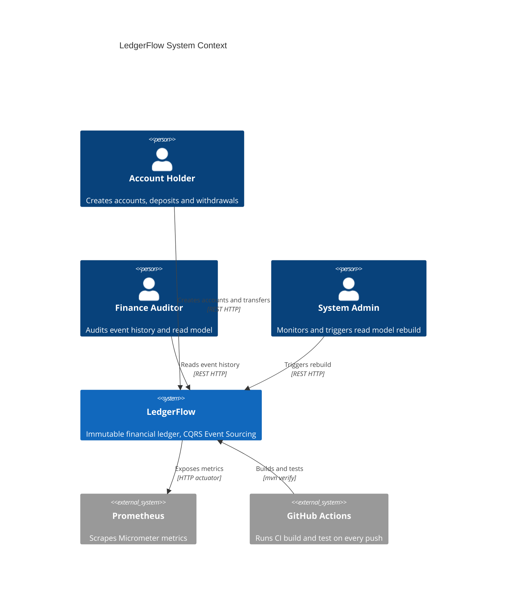

# LedgerFlow — System Context (C4 Level 1)

## Scope

LedgerFlow is a portfolio project demonstrating CQRS and Event Sourcing with Java 21 and Spring Boot 3.3. Every financial operation is stored as an immutable event; current account state is rebuilt entirely from event replay.

## Personas

| Persona | Description |
|---------|-------------|
| Account Holder | Creates accounts, deposits, withdrawals, and transfers |
| Finance Auditor | Reads full event history, validates read model consistency |
| System Admin | Triggers read model rebuild via admin endpoint |

## External Systems

| System | Role |
|--------|------|
| Prometheus | Scrapes `/actuator/prometheus` for Micrometer metrics |
| GitHub Actions | Runs `mvn verify` on every push including OWASP dependency check |
