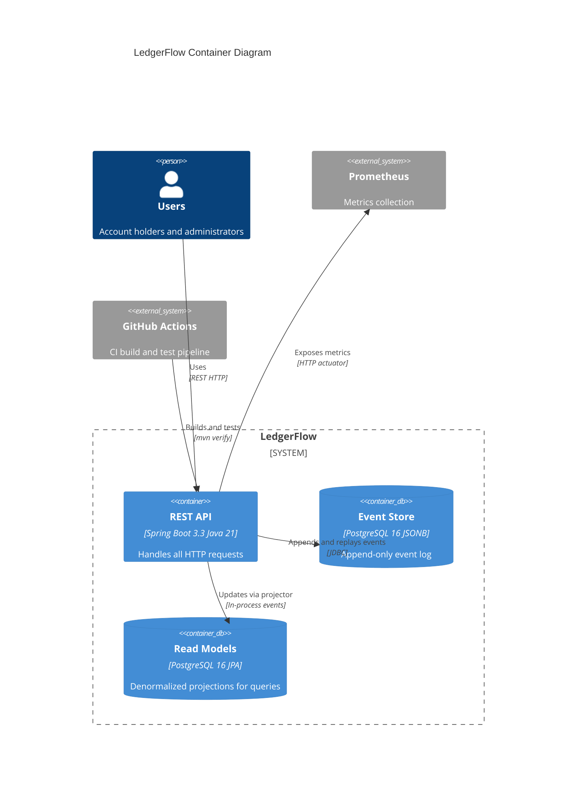

# LedgerFlow — Container Diagram (C4 Level 2)

## Notes

- The REST API is a single Spring Boot 3.3 application running on Java 21 Virtual Threads.
- Event Store and Read Models share the same PostgreSQL 16 instance but are logically separated: `event_store` table is append-only; read model tables are updated by projectors.
- Projectors listen to Spring in-process events published by `PostgresEventStore` after each successful write. The publish happens inside the same transaction boundary as the event insert.
- `CorrelationIdFilter` injects a `traceId` into MDC for all requests and clears it in `finally`.

## Containers

| Container | Technology | Responsibility |
|-----------|------------|----------------|
| REST API | Spring Boot 3.3, Java 21 | Command and query endpoints, event publishing, projectors |
| Event Store | PostgreSQL 16, JSONB | Append-only source of truth for all domain events |
| Read Models | PostgreSQL 16, Spring Data JPA | Denormalized account summaries and transaction history |
