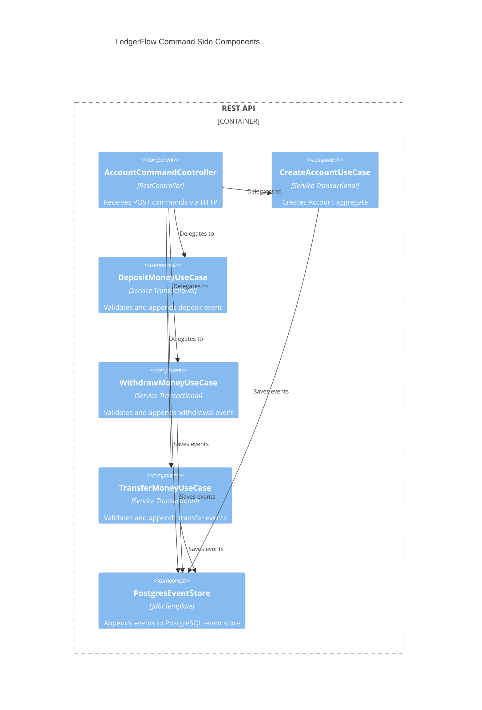

# LedgerFlow — Command Side Components (C4 Level 3)

## Command Flow

1. `AccountCommandController` receives HTTP POST and validates request body via `@Valid`
2. Delegates to the corresponding use case
3. Use case calls `PostgresEventStore.load(aggregateId)` to reconstitute `Account` via event replay
4. `Account` validates business rules against current state
5. Business operation produces a domain event, calls `apply()` to update state, and buffers in `uncommittedEvents`
6. Use case calls `PostgresEventStore.save()` which appends to `event_store` and publishes to Spring event bus within the same transaction
7. `DuplicateKeyException` on `UNIQUE(aggregate_id, sequence_number)` is translated to `OptimisticLockException`
8. Use case retries up to `ledger.command.max-retries` times on `OptimisticLockException`

## Components

| Component | Layer | Responsibility |
|-----------|-------|----------------|
| AccountCommandController | Adapter | Translates HTTP to command objects; no business logic |
| CreateAccountUseCase | Application | Produces `AccountCreated` event |
| DepositMoneyUseCase | Application | Validates positive amount; produces `MoneyDeposited` |
| WithdrawMoneyUseCase | Application | Validates balance; produces `MoneyWithdrawn` |
| TransferMoneyUseCase | Application | Validates both accounts; produces two `TransferCompleted` events |
| PostgresEventStore | Infrastructure | Append-only JDBC writes; publishes events post-persistence |
