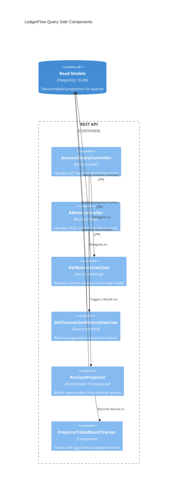

# LedgerFlow — Query Side Components (C4 Level 3)

## Query Flow

1. `AccountQueryController` receives HTTP GET and delegates to the corresponding use case
2. Use cases are `@Transactional(readOnly = true)` — read from denormalized read model tables only
3. No access to `event_store` on the query path — all data comes from projected tables

## Projection Flow

1. `PostgresEventStore.save()` publishes Spring in-process events after successful persistence
2. `AccountProjector` listens via `@EventListener` and updates `account_summary` and `transaction_history` tables
3. Idempotency: projector checks `last_event_sequence` before applying; duplicate delivery is safe
4. On failure: projector catches all exceptions, logs the error, and records the failed event in `ProjectorFailedEventTracker` — never throws, never blocks the event bus

## Rebuild Flow

1. `AdminController` receives `POST /api/v1/admin/accounts/{id}/rebuild` with `X-Admin-Key` header
2. `AdminAuthFilter` validates the key against `ADMIN_API_KEY` env var
3. Delegates to `AccountProjector.rebuild()` which truncates and replays all events for the account

## Components

| Component | Layer | Responsibility |
|-----------|-------|----------------|
| AccountQueryController | Adapter | Translates HTTP GET to query calls; no business logic |
| AdminController | Adapter | Admin rebuild endpoint; protected by AdminAuthFilter |
| GetBalanceUseCase | Application | Reads `AccountSummary` read model |
| GetTransactionHistoryUseCase | Application | Reads paginated `TransactionHistory` read model |
| AccountProjector | Application | Idempotent read model updater; never throws |
| ProjectorFailedEventTracker | Shared Infra | In-memory failure registry for projector errors |
