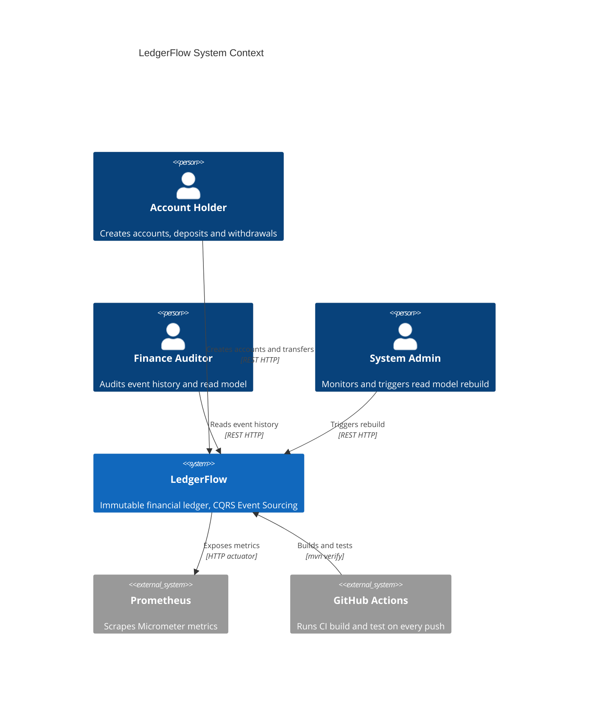

# LedgerFlow — Architecture Documentation

Immutable financial ledger with CQRS and Event Sourcing — state rebuilt from event replay.

## System Context

## Navigation

| Level | File | Scope |
|-------|------|-------|
| L1 Context | [01-context.md](01-context.md) | Personas and external systems |
| L2 Container | [02-container.md](02-container.md) | REST API, Event Store, Read Models |
| L3 Commands | [03-component-commands.md](03-component-commands.md) | Command use cases and Event Store |
| L3 Queries | [03-component-queries.md](03-component-queries.md) | Query use cases, projector, and admin |

## Architectural Decision Records

| ADR | Decision |
|-----|----------|
| [ADR-001](../adr/ADR-001-event-sourcing-vs-crud.md) | Event Sourcing as primary persistence vs CRUD |
| [ADR-002](../adr/ADR-002-cross-aggregate-transfer-and-publish-placement.md) | Cross-aggregate transfer in single transaction + publishEvent placement in PostgresEventStore |
| [ADR-003](../adr/ADR-003-in-process-events-vs-kafka.md) | In-process Spring events vs Kafka for projectors |
| [ADR-004](../adr/ADR-004-snapshot-strategy-deferred.md) | Snapshot strategy deferred to post-MVP; threshold 500 events |

## Key Patterns

| Pattern | Implementation |
|---------|---------------|
| Event Sourcing | `Account` aggregate state rebuilt via `reconstitute(events)` |
| CQRS | Command side writes only to `event_store`; query side reads only from read model tables |
| Optimistic Locking | `UNIQUE(aggregate_id, sequence_number)` on `event_store`; `DuplicateKeyException` maps to `OptimisticLockException` |
| Idempotent Projection | `AccountProjector` checks `last_event_sequence` before applying any event |
| RFC 7807 Errors | `GlobalExceptionHandler` returns `ProblemDetail` for all domain and infrastructure exceptions |
